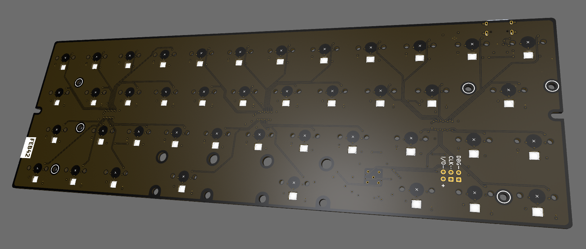
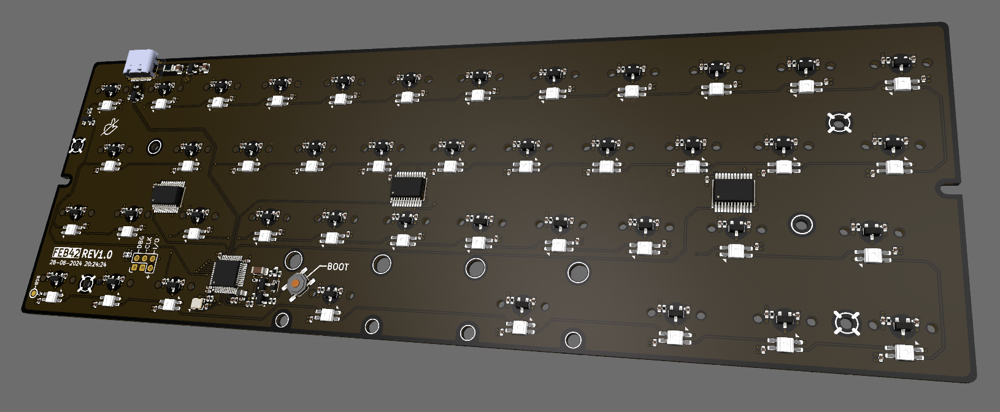

# Readme

This keyboard is a Hall-Effect replacement board for the idabao ID42.  
I made this because i use the ID42 as a daily driver and wanted to also use  
it for gaming.  
So natrually i wanted HE Switches :)  

## Compiling

### Github actions
Just fork this repo, make ur changes and push them.  
The action will provide the built artifact.

### Locally
1. Download this repository
2. Install QMK for ur OS (`https://docs.qmk.fm/newbs_getting_started`)  
3. Open QMK MSYS
4. cd into the downloaded repository 
5. run `make compile` (optionally pass `km=my_custom_keymap` if you are not using the default one)

The Makefile will automatically link the keyboard into your qmk_firmware folder,  
no need to copy things over.

#### Troubleshooting
If qmk says there is no such function "compile", make sure ur system environment variable  
`QMK_HOME` is pointing to the cloned `qmk_firmware` folder.
Then restart QMK MSYS.

